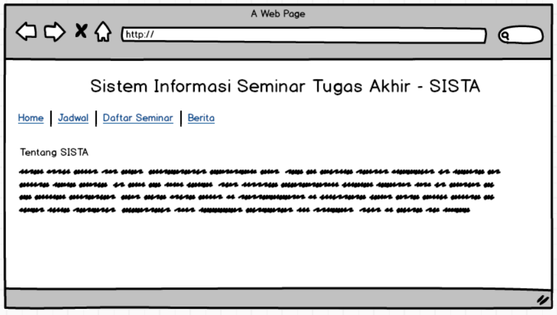
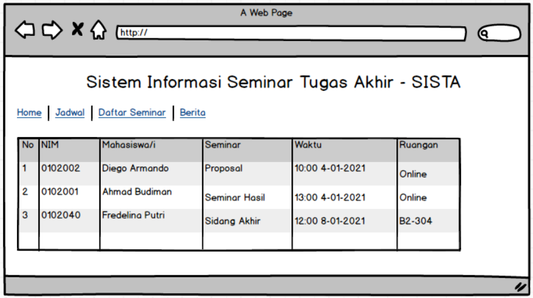
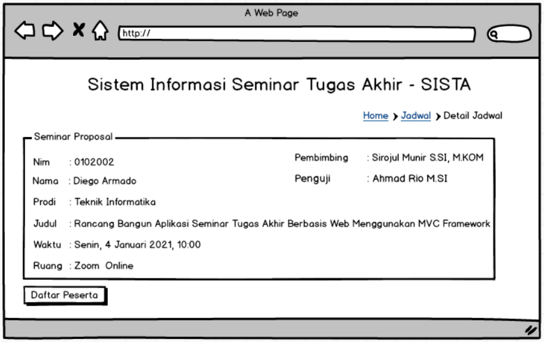
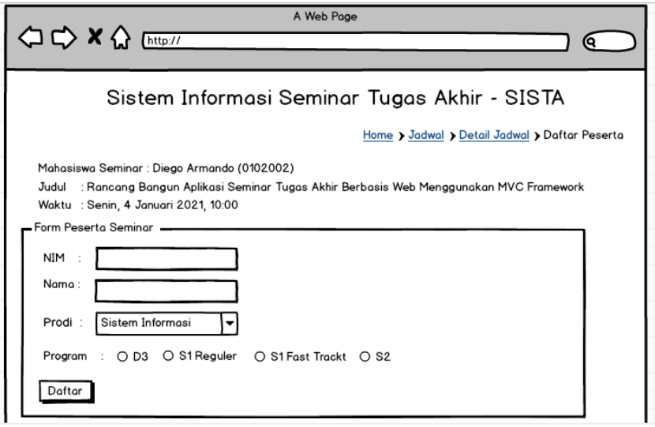
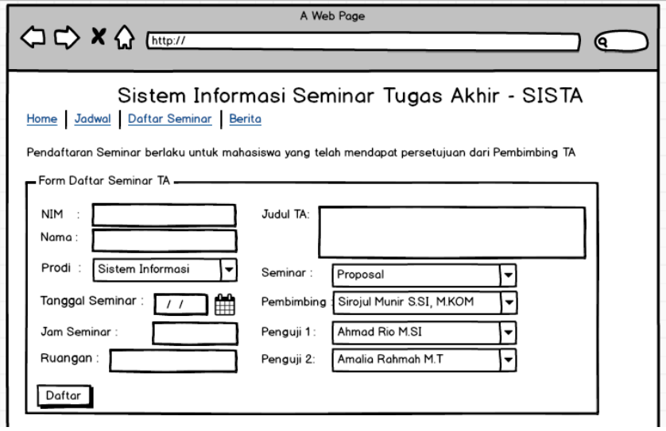
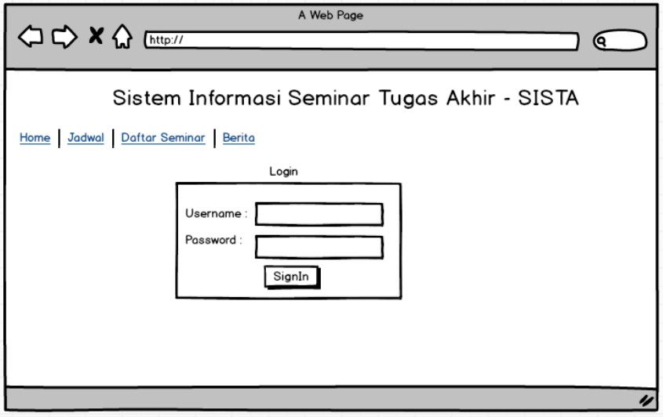
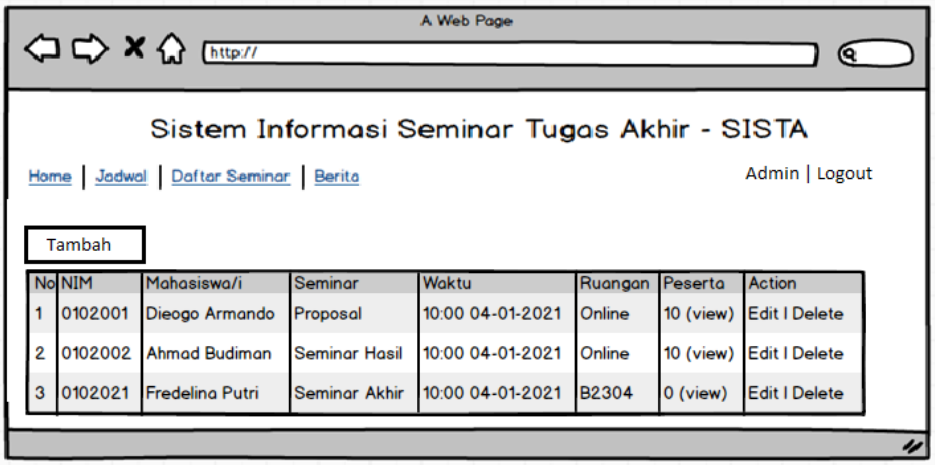
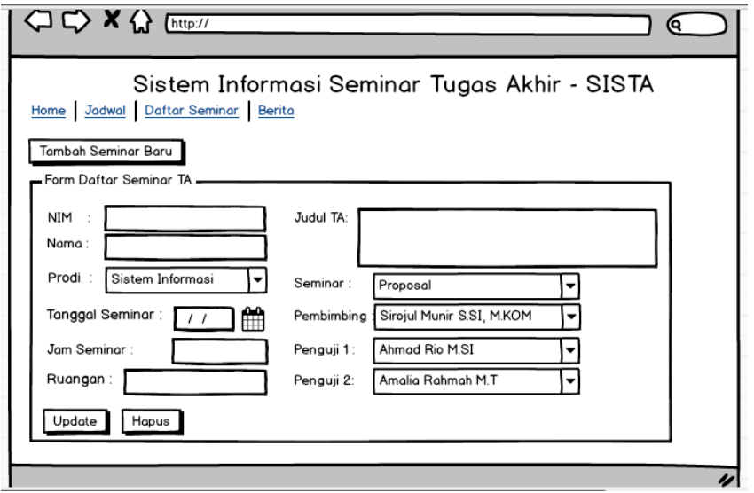

# Tugas Akhir Materi Web Design
Kelas PPL (Pengembangan Perangkat Lunak) Pesantren PeTIK 2 Jombang, Jawa Timur.

## Deskripsi Tugas
Mahasiswa membuat prototype aplikasi web frontend dengan tema proyek Sistem Informasi Seminar Tugas Akhir (SISTA), dengan desain mockup (wireframe) sudah diberikan.

## Aturan Pengerjaan
- Aplikasi sudah menggunakan konsep Responsive Web Design
- Aplikasi telah dilengkapi login dan sistem mengakomodir user public dan registred user (admin & user member)
- Form telah dilengkapi dengan validasi javascript
- Link pada setiap halaman berfungsi dengan baik
- Tugas dikerjakan kelompok (4 orang)

## Halaman desain mockup / wireframe SISTA

1. Halaman landing page

2. Halaman Jadwal Seminar TA

3. Halaman Detail Jadwal Seminar TA

4. Halaman Pendaftaran Peserta Seminar TA

5. Halaman Daftar Seminar TA

6. Halaman Login User

7. Halaman Admin Kelola Daftar Seminar TA

8. Halaman Admin Kelola Pemakalah Seminar TA

9. Halaman Admin Kelola Daftar Peserta Seminar TA

## Beberapa halaman tambahan

1.  Halaman registrasi user
2.  Halaman profil user
3.  Halaman Admin Verifikasi Registrasi User
4.  Halaman Admin Kelola Registrasi User

## Struktur SISTA yang kami buat
- index.html
- seminar
  - index.html
  - detail.html
  - daftar.html
  - buat.html
  - kelola.html
  - edit.html
  - peserta.html
- user
  - index.html
  - login.html
  - register.html
  - verif.html
  - kelola.html